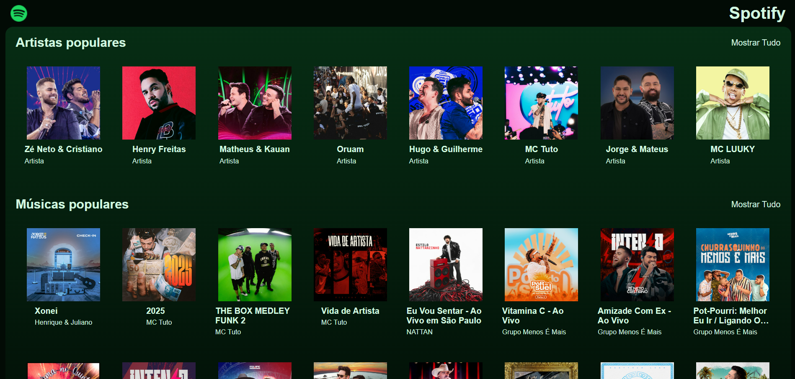
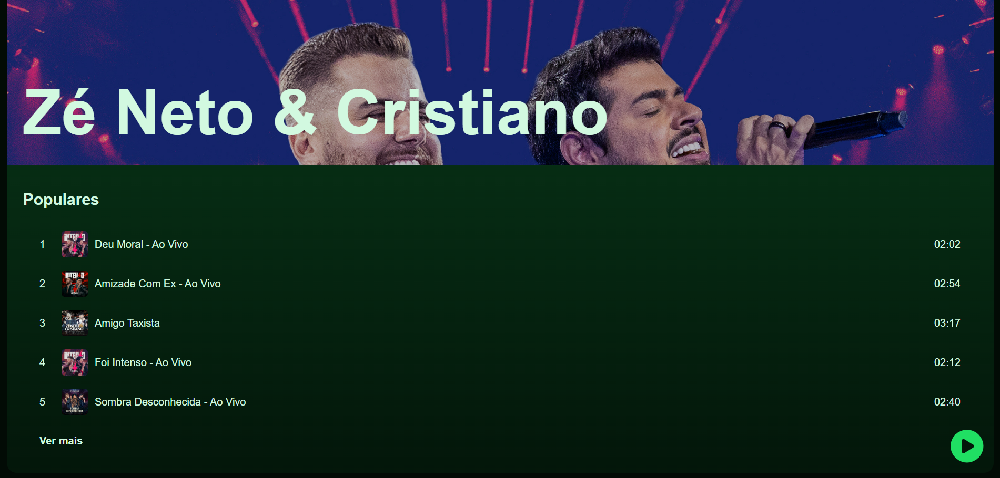
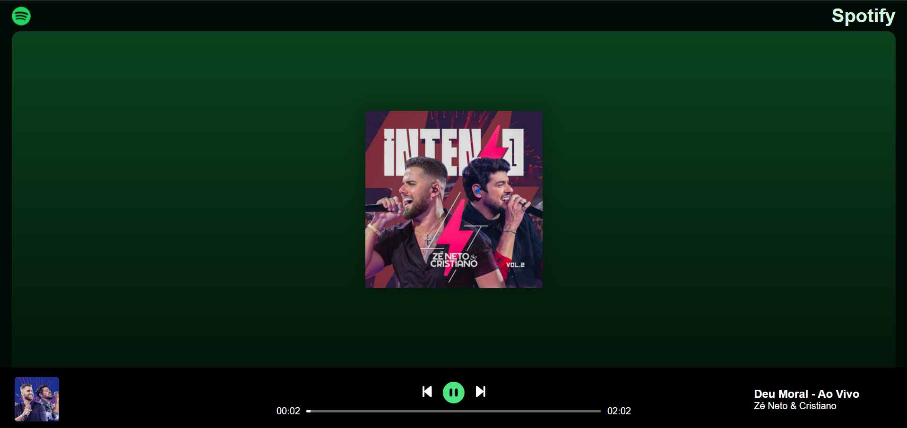

# 🎧 Clone do Spotify — Aplicação Full Stack

Aplicação **Full Stack inspirada no Spotify**, desenvolvida para simular uma plataforma de streaming de música, com foco em **integração entre front-end e back-end**, consumo de API e reprodução de áudio.
O projeto foi criado como parte de um curso prático, aplicando conceitos reais de desenvolvimento web.

<div align="center">
  
  
  
</div>

🔗 **Projeto online:** [https://projetospotify.onrender.com/](https://projetospotify.onrender.com/)

---

## 🚀 Tecnologias Utilizadas

### Front-end

- **React.js** — Construção da interface com componentes reutilizáveis.
- **Vite** — Ambiente de desenvolvimento rápido e bundling.
- **JavaScript (ES6+)** — Lógica da aplicação e interatividade.
- **CSS** — Estilização da interface com foco em layout responsivo.

### Back-end

- **Node.js** — Ambiente de execução JavaScript no servidor.
- **Express** — Criação de API REST e gerenciamento de rotas.

### Banco de Dados

- **MongoDB** — Armazenamento de dados de artistas, músicas e playlists.

### Comunicação

- **Axios** — Requisições HTTP entre front-end e API.

---

## 📌 Funcionalidades Principais

### Home

- Exibição de artistas populares.
- Exibição de músicas populares.
- Botão “Mostrar mais” para visualizar listas completas.

### Navegação e Interface

- Header com logotipo e navegação para a página inicial.
- Listagem dinâmica de artistas e músicas.
- Interface inspirada no Spotify, com foco em usabilidade.

### Páginas e Rotas

- **Home** — Artistas e músicas populares.
- **Artists** — Lista completa de artistas.
- **Songs** — Lista completa de músicas.
- **Artist** — Detalhes do artista e suas músicas.
- **Song** — Página individual da música com player funcional.

### Reprodução de Músicas

- Player com controles de:

  - Play e pause
  - Avançar e retroceder faixas

- Barra de progresso baseada no tempo da música.
- Reprodução contínua das músicas do álbum selecionado.

---

## 🧠 Destaques Técnicos

- Criação de **API REST com Express** para fornecimento de dados ao front-end.
- Integração completa entre **React e backend Node.js**.
- Uso do **MongoDB** para persistência de dados.
- Consumo de API utilizando **Axios**.
- Organização do projeto separando responsabilidades entre front-end, back-end e banco de dados.
- Simulação de fluxo real de uma plataforma de streaming.

---

## 🗂️ Organização do Projeto

```
📁 back-end
├─ 📁 api
│  ├─ 📄 connect.js        # Configuração da conexão com o MongoDB
│  ├─ 📄 insertMany.js     # Script para inserir artistas e músicas no banco de dados
│  └─ 📄 server.js         # Inicialização do servidor e definição da API
│
├─ 📄 .env                 # Variáveis de ambiente (MongoDB URI)

📁 front-end
├─ 📁 api                  # Arquivos relacionados à comunicação com a API
├─ 📁 src
│  ├─ 📁 assets
│  │  ├─ 📁 database       # Dados do projeto
│  │  └─ 📁 logo           # Logo da aplicação
│  │
│  ├─ 📁 components        # Componentes reutilizáveis da interface
│  ├─ 📁 pages             # Páginas da aplicação
│  ├─ 📄 App.jsx           # Componente raiz do React
│  ├─ 📄 main.jsx          # Ponto de entrada da aplicação
│  └─ 📄 index.css         # Estilos globais

```

---

## 🛠️ Como Rodar o Projeto Localmente

### 1️⃣ Clone o repositório

```bash
git clone https://github.com/islaianeribeiro/ProjetoSpotify.git
```

```bash
cd ProjetoSpotify
```

---

## 🔐 Configuração do Banco de Dados

Este projeto utiliza **MongoDB** para armazenar os dados de artistas e músicas.

### Pré-requisitos

- Conta no **MongoDB Atlas**
- Cluster ativo
- Node.js instalado

### Variáveis de Ambiente

Crie um arquivo `.env` na pasta do backend e adicione a string de conexão do MongoDB:

```env
MONGODB_URI=sua_uri_do_mongodb_aqui
```

> 🔒 O arquivo `.env` deve estar listado no `.gitignore` para evitar o vazamento de dados sensíveis.

---

## 📥 Inserção dos Dados no Banco

O projeto já inclui um script para popular o banco de dados com artistas e músicas de exemplo.

Execute o comando abaixo após configurar o MongoDB:

```bash
node insertMany.js
```

Esse script irá inserir:

- Aproximadamente **20 artistas**
- Cerca de **200 músicas**

Esses dados são consumidos pela API e exibidos dinamicamente no frontend.

---

## 🚀 Executando a Aplicação

Após configurar o banco e inserir os dados, execute:

```bash
npm run build
npm run start
```

Após iniciar, o projeto estará disponível no navegador.

---

## 🌐 Comunicação Frontend e Backend

O frontend se comunica com o backend por meio de uma **API REST**, utilizando **Axios**.

### Endpoints Disponíveis

- `GET /api/artists` — retorna a lista de artistas
- `GET /api/songs` — retorna a lista de músicas

---

## 📌 Status do Projeto

- ✔️ Projeto funcional e publicado
- 🔧 Possíveis melhorias futuras:

  - Autenticação de usuários
  - Criação de playlists personalizadas
  - Melhoria de performance do player
  - Interface ainda mais próxima do Spotify real

---

## 👩‍💻 Desenvolvido por

**Islaiane Ribeiro**
Front-End Developer

🔗 [https://www.linkedin.com/in/islaianeribeiro](https://www.linkedin.com/in/islaianeribeiro)

---

## 📝 Licença

MIT © 2025 — Sinta-se à vontade para usar como base para estudos e projetos pessoais.
